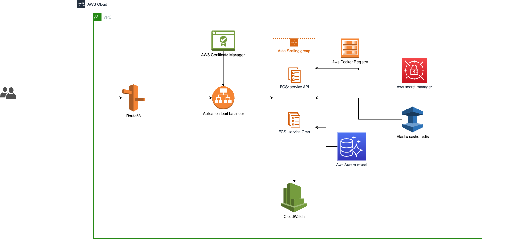
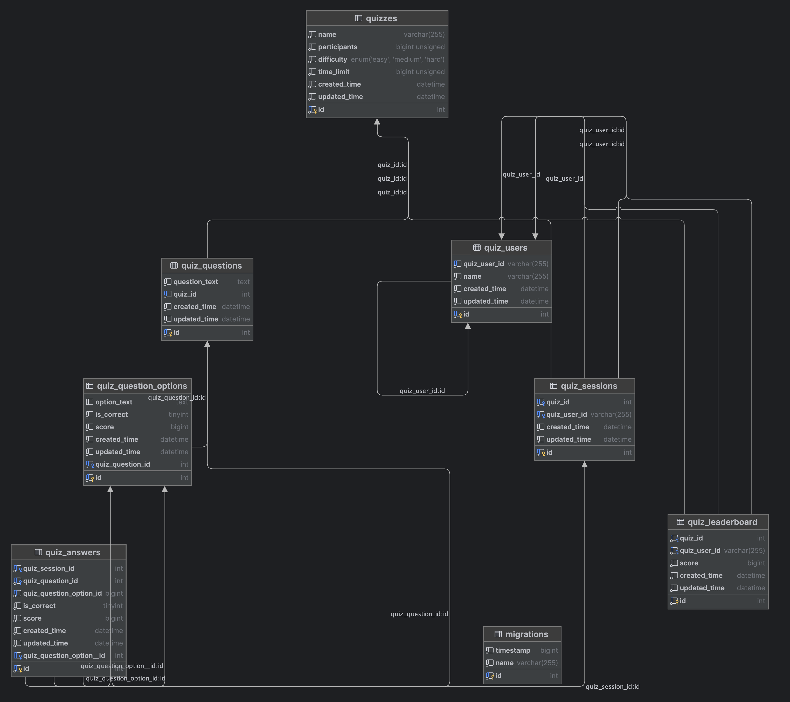

# Infrastructure
### 1. Use AWS cloud for deploying the Quiz API

#### 1.1. List used aws services
- Use AWS ECS to run applications containing 2 services:
  + Service API with the task has 2 instance
  + Service CRONJOB with the task have only 1 instance( In case the future need user cronjob )

- Use AWS docker registry for private docker repository
- Use Application load balancer in front of ECS
- Use AWS route53 and AWS certificate for config domain and ssl certificate
- Use AWS cloudwatch to monitor log, cpu, ram... of ECS
- Use AWS aurora mysql for database
- Use AWS elastic cache redis for cache( In case the future need user cache for improve performance )
- Use AWS secret manager to store env of application

#### 1.2. Diagram:


### 2. Use AWS CDK ( typescript ) to deploy infra to AWS cloud
#### 2.1 Source code folder:
```
    /cdk
```
#### 2.2 Guide to deploy:
- Create vpc from your account or can use your default vpc
- Create certificate aws with your domain
- Create a docker repo from docker registry, and manual build with the latest tag and push to this repo for the first
- Create elastic cache with redis
- Create aurora mysql and an ec2 for bridge connect from local to mysql db through ssh file pem
- Create your application env to aws secret with name "quizApiEnv" as the key below
```
        "NODE_ENV",
        "APP_NAME",
        "APP_HOST",
        "APP_PORT",
        "APP_LOGGER_LEVEL",
        "APP_CORS_ORIGIN",

        "TYPEORM_CONNECTION",
        "TYPEORM_HOST",
        "TYPEORM_PORT",
        "TYPEORM_USERNAME",
        "TYPEORM_PASSWORD",
        "TYPEORM_DATABASE",
        "TYPEORM_MIGRATIONS_RUN",
        "TYPEORM_LOGGING",
        "TYPEORM_SYNCHRONIZE",
        "TYPEORM_DROP_SCHEMA",

        "APP_JWT_PUBLIC_KEY_BASE64",
        "APP_JWT_PRIVATE_KEY_BASE64",
        "APP_JWT_EXPIRES",

        "MAILGUN_DOMAIN",
        "MAILGUN_API_KEY",
        "FROM_EMAIL",

        "REDIS_URL",
        "SWAGGER_ENABLE"
```
- Config cdk application by go to the file "cdk/bin/quiz.ts" then input correct with your information
```
    env: {
        account: "803036668764",
        region: "ap-southeast-1"
    },
    //vpc network
    vpcId: 'vpc-05d9080dcbae6c805',

    //certificate aws for https
    certificateArn: "arn:aws:acm:ap-southeast-1:803036668764:certificate/378646cc-5e8f-4dad-ac15-79416e99a254",

    //config auto scale group
    autoScalingGroupMinCapacity: 1,
    autoScalingGroupMaxCapacity: 50,
    autoScalingGroupDesiredCapacity: 1,
    instanceType: 't3.medium',

    //config instance for api task, instance for cron task have only one instance
    ecsMinCapacity: 2,
    ecsMaxCapacity: 100,
    ecsDesiredCount: 2,

    //task definition
    image: '803036668764.dkr.ecr.ap-southeast-1.amazonaws.com/quiz-api:latest',
    taskDefinitionMemoryLimitMiB: 512,
    taskDefinitionCpu: 256,
    envSecretName: "quizApiEnv",

```
- Run deploy cdk by go to the root folder cdk and run command below (make sure you created user from aws and input: aws_access_key_id, aws_secret_access_key, region to your local machine)
```
    yarn install   
    cdk bootstrap
    cdk deploy

```

- Once infra is deployed successful to ecs, you need input correct the info relate to file ".github/workflows/deploy-prod.yml"
```
  AWS_REGION: ap-southeast-1
  ECR_REPOSITORY: quiz-api
  ECS_CLUSTER: QuizStack11-QuizEcsCluster7EDE3B5D-GI8mnEP14GkB
  ECS_SERVICE: QuizStack11-QuizEcsService7029E1EC-Orx84Ju1doYr
  ECS_SERVICE_CRON: QuizStack11-QuizEcsServiceCronService7914C767-MytYbCxuYwMh
```

- Also copy the content of 2 task definition from aws console ecs to 2 file: ".github/workflows/task-definition-cron-prod.json" and ".github/workflows/task-definition-prod.json"
- Then config add secrets from github "AWS_ACCESS_KEY_ID" and "AWS_SECRET_ACCESS_KEY" for allow git have permission to deploy source to aws ecs
- Now we can use git action to deploy source by
  + Create a release tag( for example: v1.0.10 ) from main branch
  + Go to git action input and deploy with this tag


# Database Diagram


# Backend API

## The quiz application information:
+ API: https://quiz-api.mikedutuandu.com/
+ WEB APP: https://quiz-app.mikedutuandu.com/
+ API DOC: https://quiz-api.mikedutuandu.com/swagger
```
swagger user: dev
swagger pass: 123456aA@
```
## CI/CD 
- Git action

## Technical Implementation Summary
- Nestjs with typescript for implement the Rest API and Websocket
- Aurora mysql for database
- Swagger to document to api

## Run on local
```
  npm run install
  npm run start:dev
```
